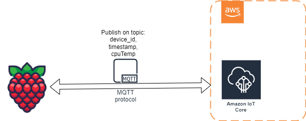

# RaspberryPi_AWS_PUB

A simple project demonstrating how to publish CPU temperature data from a Raspberry Pi to AWS IoT Core over MQTT. 

## Table of Contents
- [RaspberryPi\_AWS\_PUB](#raspberrypi_aws_pub)
  - [Table of Contents](#table-of-contents)
  - [Overview](#overview)
  - [Prerequisites](#prerequisites)
  - [Setup \& Configuration](#setup--configuration)
    - [Raspberry Pi](#raspberry-pi)
  - [Usage](#usage)
  - [Testing with CPU Burner](#testing-with-cpu-burner)
  - [Roadmap](#roadmap)
  - [License](#license)

## Overview
This repository provides a quick-start project that collects and publishes mock data (CPU temperature) from a Raspberry Pi to AWS IoT Core using Python3 and the AWS Python SDK (v2). You can use it as a base template or learning reference for building more advanced IoT applications.



## Prerequisites
- **Hardware**: Raspberry Pi (tested on Raspberry Pi 2 B with 32-bit Raspberry Pi OS Lite, kernel 6.6, Debian 12 / Bookworm).
- **Operating System**: Raspberry Pi OS Lite.
- **Python 3**: Ensure Python 3 is installed.
- **AWS SDK for Python (Boto3 / AWSIoTPythonSDK)**: Python library for connecting to AWS IoT Core.
- **AWS IoT Core Account**: You should have an AWS account set up, with the IoT Core service enabled.
- **Certificates**: Hardcoded certificates are used in this project. Replace these with your own from AWS IoT Core if needed.

> **Note**: The repository does not include actual AWS IoT certificates. They need to be generated via the AWS IoT console or CLI. The placeholders in this project are for demonstration.

## Setup & Configuration
### Raspberry Pi
1. **Clone the Repository**:
   ```bash
   git clone https://github.com/Saqqe/RaspberryPi_AWS_PUB.git
2. **Prepare Environment**:
   ```bash
   cd RaspberryPi_AWS_PUB
   touch .env # Store Key-Value pairs for AWS Credentials paths
   touch .gitignore # add .env to .gitignore
   mkdir ~/aws_credentials # Create a directory for AWS credentials/certificates
3. **Install Dependencies**:
	https://github.com/aws/aws-iot-device-sdk-python-v2
   ```bash
   sudo apt-get update
   sudo apt-get install python3-pip
   python3 -m pip install awsiotsdk
### AWS
3. **Setup AWS IoT Core and obtain AWS Certificates**
   - Log in to the AWS Console.
   - Navigate to **AWS IoT Core**
   - Use the **Connect a device** wizard to create and download your certificates and keys.
     - Get this over to your Raspberry Pi folder `~/aws_credentials`
  
4. **Configure Environment Variables on RaspberryPi**:
   ```bash   
   nano .env # open .env
   ```
Add the following lines to .env and change according to your needs

   ```bash
   AWS_ENDPOINT = 'Your AWS endpoint'
   CLIENT_ID = 'what ever you want to name your device'
   TOPIC = 'raspberrypi/mqtt/test'
   CA_CERT_PATH = 'AmazonRooTCert'
   CERT_PATH = 'DeviceCert'
   PRIVATE_KEY_PATH = 'Your private key'
   ```	
## Usage
1. **Run the Python Script**:
   ```bash
   python3 pub_temp_to_aws.py

2. **Monitor Data in AWS IoT Core**:
   - In the AWS IoT console, go to **MQTT test client**.
   - Subscribe to the same topic used in your Python script.
   - You should see incoming messages displaying CPU temperature data.

## Testing with CPU Burner
Inside the `test` folder, you’ll find a small “cpuburner” program that increases CPU load, thereby raising CPU temperature. This is useful for observing varying temperature readings.

1. **Navigate to the `test` Folder**:
   cd test

2. **Compile or Run the CPU Burner** (assumes you have GCC installed):
   ```bash
   gcc cpuburner.c -o cpuburner
   ./cpuburner

3. **Monitor the Python Script**:
   - Run `pub_temp_to_aws.py` in a separate terminal.
   - Watch how the temperature readings increase in the AWS IoT console.

## Roadmap
- **Additional Sensor Integration**: Optionally expand to support other sensors or additional Raspberry Pi metrics (e.g., memory usage, disk space).
- **AWS**: Add support for AWS IoT Core and other AWS services.

## License
This project is licensed under the [MIT License](LICENSE). Feel free to modify and distribute as permitted.